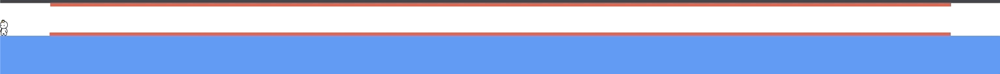

# react-flying-scroller

> scroller with flying effect navigator for React

## Demo

https://idbdyoung.com

## Installation

```bash
$ npm install --save react-flying-scroller
```

### Peer dependencies

This package expect the following peer dependencies:

```
  "react": "^16.8.1 || ^17 || ^18",
  "react-dom": "^16.8.1 || ^17 || ^18"
```

## Example

`1. clone this repository`

```
$ git clone https://github.com/idbdyoung/flying-scroller.git
```

`2. run script`

```
$ npm run dev
```

`3. app is running on localhost port 8080`

```
http://localhost:8080
```

## Usage

`1. You have to wrap your app with the Provider:`

```js
// index.js
import React from "react";
import { render } from "react-dom";
import { Provider as FlyingScrollerProvider } from "react-flying-scroller";
import App from "./App";

const Root = () => {
  <FlyingScrollerProvider>
    <App />
  </FlyingScrollerProvider>,
};

render(<Root />, document.getElementById("root"))
```

`2. Import 'Container' component and wrap the entire component you want to scroll through:`

```js
// App.js
import React from "react";
import { Container as ScrollContainer } from "react-flying-scroller";

const App = () => {
  return (
    <div className="app-container">
      <ScrollContainer>
        <div className="content"></div>
        <div className="content"></div>
        <div className="content"></div>
      </ScrollContainer>
    </div>
  );
};

export default App;
```

- Please clearly set the container height:

  ```js
  //set height directly on the container
  const App = () => {
    return (
      <div className="app-container">
        <ScrollContainer style={{ height: "1000px" }}>
          <div className="content"></div>
          <div className="content"></div>
          <div className="content"></div>
        </ScrollContainer>
      </div>
    );
  };

  //or set height to parent component
  const App = () => {
    return (
      <div
        className="app-container"
        style={{
          display: "flex",
          flexDirection: "column",
          height: "100vh",
        }}
      >
        <ScrollContainer style={{ flex: 1 }}>
          <div className="content"></div>
          <div className="content"></div>
          <div className="content"></div>
        </ScrollContainer>
      </div>
    );
  };

  export default App;
  ```

`3. Then import 'Board' component and place the component where you want it:`

```js
// App.js
import React from "react";
import {
  Container as ScrollContainer,
  Board as ScrollBoard,
} from "react-flying-scroller";

const App = () => {
  return (
    <div className="app-container">
      <ScrollBoard />
      <ScrollContainer>
        <div className="content"></div>
        <div className="content"></div>
        <div className="content"></div>
      </ScrollContainer>
    </div>
  );
};

export default App;
```

## Direct scroll

You can scroll to specific component with Wrapper component and useDirectScroll hook

`1. Import the Wrapper component and wrap the component you want to scroll directly:`

```js
// App.js
import React from "react";
import {
  Container as ScrollContainer,
  Board as ScrollBoard,
  Wrapper as ScrollWrapper,
} from "react-flying-scroller";

const App = () => {
  return (
    <div className="app-container">
      <ScrollBoard />
      <ScrollContainer>
        // Name it whatever you want!!
        <ScrollWrapper name="first">
          <div className="content"></div>
        </ScrollWrapper>
        <div className="content"></div>
        <div className="content"></div>
      </ScrollContainer>
    </div>
  );
};
```

`2. Then import useDirectScroll hook and pass the name you set to the scroll wrapper as a property of the hook:`

```js
// App.js
import React from "react";
import {
  Container as ScrollContainer,
  Board as ScrollBoard,
  Wrapper as ScrollWrapper,
  useDirectScroll,
} from "react-flying-scroller";

const App = () => {
  return (
    <div className="app-container">
      // The hook returns a function that scrolls directly to the component
      <button onClick={useDirectScroll("first")}>go to first</button>
      <ScrollBoard />
      <ScrollContainer>
        // Name it whatever you want!!
        <ScrollWrapper name="first">
          <div className="content"></div>
        </ScrollWrapper>
        <div className="content"></div>
        <div className="content"></div>
      </ScrollContainer>
    </div>
  );
};
```

Now clicking the button, you can go directly to the specified component!

## Options

### Style

`You can style each of the Board and Container components in an inline styling way:`

```js
// App.js
import React from "react";
import {
  Container as ScrollContainer,
  Board as ScrollBoard,
} from "react-flying-scroller";

const containerStyle = {
  height: "1000px",
};

const boardStyle = {
  height: "50px",
};

const App = () => {
  return (
    <div className="app-container">
      <Board style={boardStyle} />
      <ScrollContainer style={containerStyle}>
        <div className="content"></div>
        <div className="content"></div>
        <div className="content"></div>
      </ScrollContainer>
    </div>
  );
};
```

### Avatar image

` You can also add any avatar image you want:`

```js
// App.js
import React from "react";
import {
  Container as ScrollContainer,
  Board as ScrollBoard,
} from "react-flying-scroller";

import IronMan from "/images/IronMan.png";
import StandingMan from "/images/Standing.png";

// You must set both walking image and flying image.
const avatarImage = {
  Standing: StandingMan,
  Flying: IronMan,
};

const App = () => {
  return (
    <div className="app-container">
      <Board />
      <ScrollContainer avatarImage={avatarImage}>
        <div className="content"></div>
        <div className="content"></div>
        <div className="content"></div>
      </ScrollContainer>
    </div>
  );
};
```

it works like this!!


`The avatar size is adjusted based on the height, and the avatar height is 1/2 of the board component height.`

```js
// App.js
import React from "react";
import {
  Container as ScrollContainer,
  Board as ScrollBoard,
} from "react-flying-scroller";

import IronMan from "/images/IronMan.png";
import StandingMan from "/images/Standing.png";

const avatarImage = {
  Standing: StandingMan,
  Flying: IronMan,
};

const App = () => {
  return (
    <div className="app-container">
      <Board style={{ height: "100px" }} /> //avatar height will be 50px
      <ScrollContainer avatarImage={avatarImage}>
        <div className="content"></div>
        <div className="content"></div>
        <div className="content"></div>
      </ScrollContainer>
    </div>
  );
};
```

## Game

`You can play simple game 🚀🚀`



`Set the game options to the ScrollContainer's props.`

```js
// App.js
import React from "react";
import {
  Container as ScrollContainer,
  Board as ScrollBoard,
} from "react-flying-scroller";

import IronMan from "/images/IronMan.png";
import StandingMan from "/images/Standing.png";

const gameOptions = {
  range: {
    start: 5,
    end: 95,
  },
  difficulty: 1,
};

const App = () => {
  return (
    <div className="app-container">
      <Board style={{ height: "100px" }} />
      //set gameOptions
      <ScrollContainer gameOption={gameOptions}>
        <div className="content"></div>
        <div className="content"></div>
        <div className="content"></div>
      </ScrollContainer>
    </div>
  );
};
```

### Game restart

`When you clear the game, you can get a function to restart the game via the useGame hook. You can also get the game playable state`

```js
// App.js
import React from "react";
import {
  Container as ScrollContainer,
  Board as ScrollBoard,
  useGame,
} from "react-flying-scroller";

import Navigation from "/component/Navigation";
import IronMan from "/images/IronMan.png";
import StandingMan from "/images/Standing.png";

const gameOptions = {
  range: {
    start: 5,
    end: 95,
  },
  difficulty: 1,
};

const App = () => {
  const { gamePlayable, playAgain } = useGame();

  return (
    <div className="app-container">
      <Board style={{ height: "100px" }} />
      {!gamePlayable && (
        <>
          <Navigation />
          <div onClick={playAgain}>reGame</div>
        </>
      )}
      <ScrollContainer gameOption={gameOptions}>
        <div className="content"></div>
        <div className="content"></div>
        <div className="content"></div>
      </ScrollContainer>
    </div>
  );
};
```

`Enjoy!! 😀🚀`
